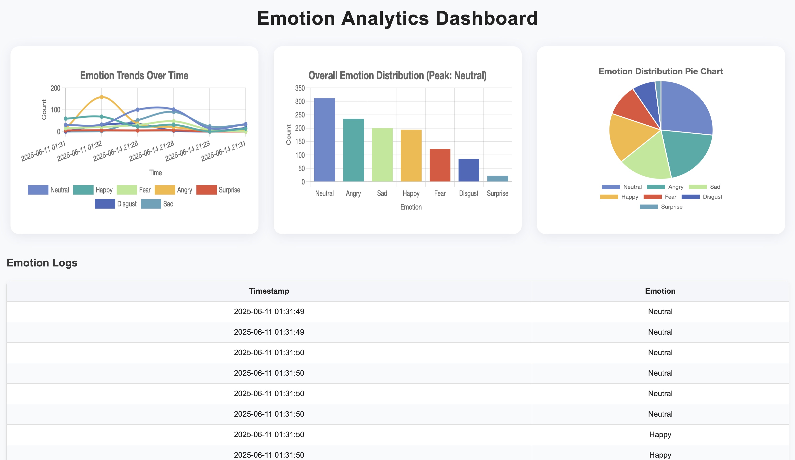

🎥 Smart Video Companion – Real-Time Emotion Analytics Dashboard
```
A real-time facial emotion recognition system that captures webcam input, detects emotional expressions using deep learning, logs them with timestamps, and visualizes trends on an interactive dashboard.
✨ Features
🤖 Emotion Detection using a CNN-based model (mini-XCEPTION)
🎥 Live Webcam Feed via OpenCV
🧠 Classification into 7 emotions: Angry, Disgust, Fear, Happy, Sad, Surprise, Neutral
🗂️ CSV Logging of detected emotions with timestamps

📊 Flask Dashboard with:
    Line chart for emotion trends
    Bar chart showing total emotion counts
    Pie chart for emotion share
    Scrollable emotion logs table
🧠 Tech Stack
    ML/DL: TensorFlow, Keras
    CV: OpenCV
    Backend: Flask
    Frontend: HTML, CSS, Chart.js
    Data: Pandas, NumPy
🗂️ Project Structure
smart-video-companion/
├── models/
│   └── emotion_model.h5
├── src/
│   └── detect_emotion.py
├── web/
│   ├── app.py
│   └── templates/
│       └── index.html
├── emotion_log.csv
├── requirements.txt
└── README.md

🚀 Getting Started
1. Clone the repository
git clone https://github.com/maitreepatel1110/smart-video-companion.git
cd smart-video-companion

2. Set up a virtual environment and install dependencies
bash
python3 -m venv .venv
source .venv/bin/activate   # On Windows: .venv\Scripts\activate
pip install -r requirements.txt

3. Download the pre-trained emotion model
mkdir -p models
curl -L https://github.com/oarriaga/face_classification/raw/master/trained_models/emotion_models/fer2013_mini_XCEPTION.102-0.66.hdf5 -o models/emotion_model.h5

4. Run the real-time emotion detector
python src/detect_emotion.py
This will open your webcam and start logging detected emotions to emotion_log.csv.

5. Launch the dashboard
cd web
python app.py
Then visit: http://127.0.0.1:5000 in your browser.

📊 Example Output
CSV Log:
Timestamp,Emotion
2025-06-11 15:22:13,Happy
2025-06-11 15:22:14,Neutral

Dashboard:



📈 Emotion trends over time
📊 Bar chart of total emotion counts
🥧 Pie chart of emotion share
📋 Tabular log with timestamps

🔧 Future Improvements
Upgrade to AffectNet or FER+ trained ResNet models
Add audio sentiment analysis
Deploy via Docker or Streamlit
Push logs to Firebase/MongoDB for multi-user analysis
```
